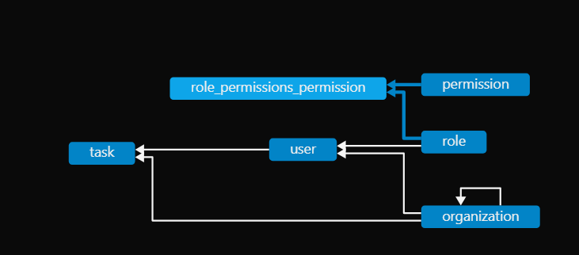

## Setup Instructions

### 1. Install Dependencies

```bash
npm install
```

### 2. Environment Variables

Create a `.env` file inside the `apps/api` directory with the following content:

```
JWT_SECRET='jwt_secret_value'
```
for sqlite once downloaded and setup successfully(https://sqlite.org/download.html) extract the files and move it to c drive and add the file path to the system variable path, db  along with tables should be auto generated with seed data . if backend is running

### 3. Running the Applications

#### Backend (NestJS API)
cd into the repo folder 
```bash
npm run serve:api
or run script as in the package.json scripts section which is same as below
npx nx serve api
```

#### Frontend (Angular Dashboard)

```bash
npm run serve:dashboard
or run script as in the package.json scripts section which is same as below
npx nx serve dashboard
```
## there are also separate scrips for unit tests in the scripts section
npx nx test api 
npx nx test dashboard
---
# Architecture Overview

## NX Monorepo Layout and Rationale

This project uses the [NX](https://nx.dev/) monorepo approach to organize multiple applications and libraries in a single repository. The rationale for using NX includes:

- **Code Sharing:** Easily share code between backend, frontend, and libraries.
- **Consistent Tooling:** Unified build, test, and linting processes.
- **Scalability:** Supports growing teams and projects with clear boundaries.
- **Dependency Graph:** NX tracks dependencies for efficient builds and testing.

## Project Structure

```
apps/
  api/         # NestJS backend application
  dashboard/   # Angular frontend application
libs/
  data/        # Shared TypeScript interfaces & DTOs
  auth/        # Reusable RBAC logic and decorators
```

### apps/

- **api/**: Contains the NestJS backend, responsible for business logic, data access, and API endpoints.
- **dashboard/**: Contains the Angular frontend, responsible for user interface and client-side logic.

### libs/

- **data/**: Houses shared TypeScript interfaces and Data Transfer Objects (DTOs) used by both backend and frontend for type safety and consistency.
- **auth/**: Contains reusable authentication and Role-Based Access Control (RBAC) logic, including custom decorators and guards, to be used across applications.

## Shared Libraries/Modules Explanation

- **data**: Ensures both backend and frontend use the same data models, reducing duplication and errors.
- **auth**: Centralizes authentication and authorization logic, making it easy to apply consistent security policies across the monorepo.

## Access Control Implementation

### Roles, Permissions, and Organization Hierarchy

- **Roles** (Owner, Admin, Viewer) define the level of access a user has within an organization.
- **Permissions** (e.g., `create_task`, `edit_task`, `delete_task`, `view_task`) are assigned to roles, controlling what actions users can perform.
- **Organization Hierarchy**: Organizations can have parent-child relationships. Roles and permissions are scoped to organizations, allowing granular access control across organizational boundaries.

### JWT Authentication and Access Control Integration

- **JWT Auth**: Users authenticate via JWT tokens. The token payload includes user identity and role information.
- **Guards**: The backend uses guards (`JwtGuard`, `RolesGuard`) to enforce authentication and authorization:
  - `JwtGuard` verifies the JWT and attaches the user to the request.
  - `RolesGuard` checks if the user's role meets the required permissions for an endpoint, considering role hierarchy.
- **RBAC Logic**: Decorators (e.g., `@Roles('Admin')`) specify required roles for routes. The guard compares the user's role (from JWT) against these requirements.

---

## Data Model Explanation

The data model is designed to support secure, role-based task management across organizations with hierarchical relationships.

### Schema Overview

- **User**: Represents an individual with credentials, belongs to an organization, and is assigned a role.
- **Organization**: Supports parent-child hierarchy, grouping users and tasks.
- **Role**: Defines access level (Owner, Admin, Viewer) and is linked to permissions.
- **Permission**: Represents allowed actions (e.g., create_task, edit_task).
- **Task**: Assigned to a user and organization, includes fields for title, description, category, status, and order.
- **Role-Permission Mapping**: Roles are associated with multiple permissions via a join table.

### Entity Relationships

- A **User** belongs to one **Organization** and one **Role**.
- An **Organization** can have a parent and multiple children (hierarchy).
- A **Role** can have multiple **Permissions** (many-to-many).
- A **Task** is assigned to a **User** and an **Organization**.
- The **role_permissions_permission** join table links roles and permissions.

### ERD



---

## API Documentation

### Authentication

#### `POST /auth/login`
For different logins Use
```json
{ email: 'owner@org.com', password: 'pass' }
{ email: 'admin@org.com', password: 'pass'}
{ email: 'viewer@org.com', password: 'pass'}
```

**Request:**
```json
{
  "email": "owner@org.com",
  "password": "pass"
}
```
**Response:**
```json
{
  "access_token": "JWT_TOKEN"
}
```

---

### Tasks

#### `POST /task`
**Access:** Owner, Admin  
**Fine-grained:** Must have `create_task` permission in their organization.  
**Description:** Create a new task.

**Request:**
```json
{
  "title": "New Task",
  "description": "Details...",
  "category": "Work",
  "status": "Todo",
}
```
**Response:**
```json
{
  "id": 1,
  "title": "New Task",
  "status": "Todo",
  // ...other fields...
}
```

#### `GET /tasks`
**Access:** Viewer, Owner, Admin  
**Fine-grained:**  
- Admin: Lists all tasks in the system.  
- Owner: Lists all tasks in their organization.  
- Viewer: Lists only tasks assigned to themselves or with in the same organization and  should have `view_task` permission, with optional filters.  
**Description:** List tasks.

**Response:**
```json
[
  {
    "id": 1,
    "title": "Sample Task",
    "description": "Details...",
    "status": "Todo",
    "category": "Work",
    "order": 0
    // ...other fields...
  }
]
```

#### `PUT /task/:id/order`
**Access:** Owner, Admin  
**Fine-grained:** Must belong to the same organization as the task.  
**Description:** Update task order.

**Request:**
```json
{ "order": 2 }
```
**Response:**
```json
{ "success": true }
```

#### `PUT /editTask/:id`
**Access:** Owner, Admin  
**Fine-grained:**  
- Owner: Can edit any task in their organization.  
- Admin: Can edit any task in their organization.  
- Viewer: Cannot edit.  
**Description:** Edit a task.

**Request:**
```json
{
  "title": "Updated Task",
  "description": "Updated details"
}
```
**Response:**
```json
{
    "id": 6,
    "title": "test",
    "description": "data edit",
    "category": "Work",
    "status": "Todo",
    "order": 0
}
```

#### `DELETE /deleteTask/:id`
**Access:** Owner, Admin  
**Fine-grained:**  
- Owner: Can delete any task in their organization.  
- Admin: Can delete any task in their organization.  
- Viewer: Cannot delete.  
**Description:** Delete a task.

**Response:**
```json
{ "deleted": true }
```

---

### Audit Log

#### `GET /audit-log`
**Access:** Owner, Admin  
**Description:** Get audit log of actions performed.

**Response:**
```json
[
  {
   "userId": 3,
    "action": "LIST_TASKS",
    "timestamp": "2025-09-22T01:29:53.023Z"
  }
]
```

---

## Future Considerations

### Advanced Role Delegation

- Support for custom roles and dynamic permission assignment.
- Delegation of specific permissions to users for granular access control.
- Organization-level role inheritance and temporary role elevation.

### Production-Ready Security: JWT Refresh Tokens

- Implement JWT refresh tokens for secure, long-lived sessions.
- Store refresh tokens securely (e.g., HTTP-only cookies).
- Add endpoints for token renewal and revocation.
- Monitor token usage and implement rotation strategies.

### Scaling Permission Checks Efficiently

- Cache role-permission mappings in memory or use distributed caching (e.g., Redis) to reduce database lookups.
- Batch permission checks for bulk operations.
- Use indexed queries and denormalized tables for fast lookups in large organizations.
- Consider policy engines  for complex, dynamic access rules.

## Adding Validations in the UI for the task modal
## Add Role-based and fine-grained access to the UI HTML elements so the user can see and perform the actions they are permitted to (EDIT, DELETE, CREATE).
---
